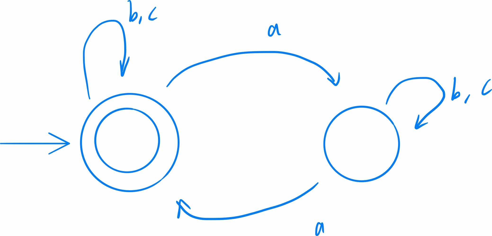

# CS241 - Lecture 7, Jan 28

## Last Class - DFA
- Typically each state has exactly one transition on each letter in $\Sigma$
  - e.g. $\Sigma=\{a,b\}$
- CS241 is relaxed on this

## DFA with actions
Consider $L=\{$binary numbers with no leading 0's$\}$

Then $\Sigma=\{0,1\}$. Our regex is $1(0|1)^*|0$

## Nondeterministic Finite Automata
An NFA allows more than 1 transition on a given alphabet symbol from a state.

Allows for simpler diagrams than DFAs.
- Machine "guesses" when to stay in the first state
- 
- 

## Formal Definition - NFA
Formally, an NFA $M$ is a 5-tuple $M=(\Sigma, Q, q_0, A,\delta)$
- $\Sigma$ - non-empty, finite alphabet
- $Q$ - non-empty, finite set of states
- $q_0$ - start state
- $A\subset Q$ - set of accepting states
- $\delta:(Q\times )$

### Acceptance in an NFA
Since the NFA transition fnction is different than a DFA, we must fix the extended transitions functions and the definition of acceptance.  

### Example
$L=\{$cab$\}\cup\{$strings with an even number of a's$\}$

In our DFA, how many states do we have?
- Found c of cab and even number of a's
- found ca of caband odd number of a's
- state of matching each of the patterns you are looking for
- The DFA will get really messy since it's deterministic

Images
- 
- 
- 

## Conversion: NFA to DFA
- 