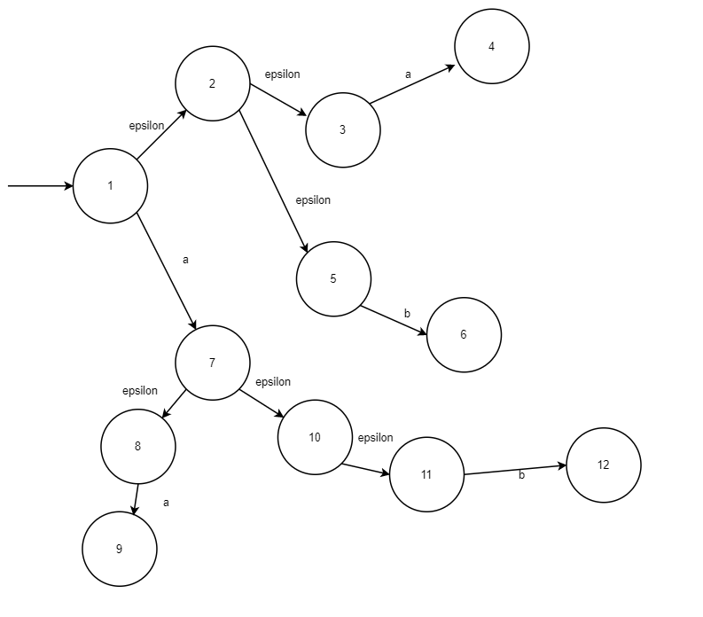

# CS241 - Lecture 8, Jan 30

## Last Class - Conversion of an NFA to a DFA

When creating NFAs, make sure they accept exactly the set of strings asked for - no more, no less

## Languages of NFAs
Are NFAs more powerful than DFA; i.e. is there some NFA $M$, where there is no DFA that accepts $L(M)$?
- Every DFA is an NFA with only single choice of transition at each state
- Every NFA can be converted to a DFA that accepts exactly the same language
- Thus, NFAs accept exactly the class of Regular languages

To show a language is regular, we can either
- find a regex
- find a DFA
- find an NFA

## $\epsilon$-NFAs
These extend NFAs by also allowing a change of state on $\epsilon$. More complex? More powerful? More paths to follow?

### Example

"start" could be in states 1,2,3,4,5
- consume 'a':7, 4
- follow more $\epsilon$-transitions: 7 $\to$ 8 or $7\to 10\to 11$

## Simulating $\epsilon$-NFAs
- After consuming 'a', could be in {7,4,8,10,11}

$\epsilon$-closure({1}) = {1, 2, 3, 5}

$\epsilon$-closure({7, 4}) = {7, 4, 8, 10, 11}

## Motivation
Easier to draw and design.

E.g. $L=\{cab\}\cup\{\text{even \# a's}\}\cup\{\text{ends in abb\}}$

\# of states in a DFA? A state of the DFA:
- where we are in recognizing 'c', 'ca', 'cab' - 4? states
- even or odd a's - 2 states
- 'a', 'ab', 'abb' - 32 states? TOO HARD